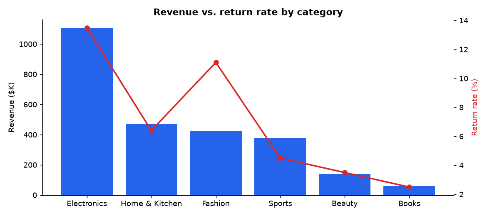
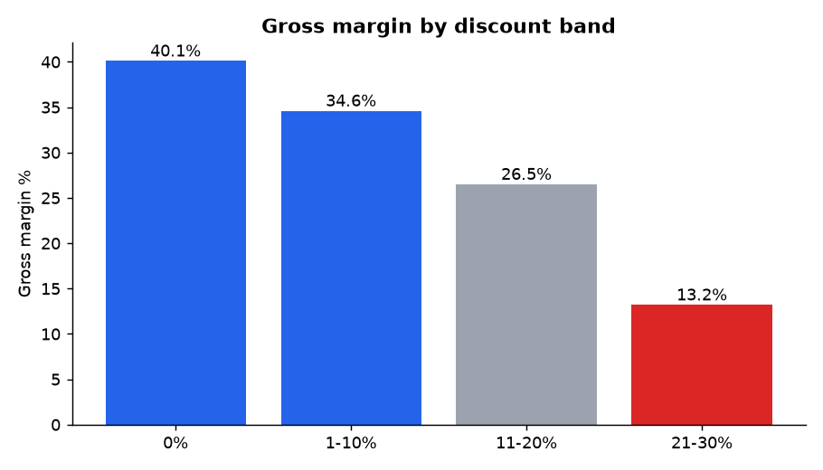
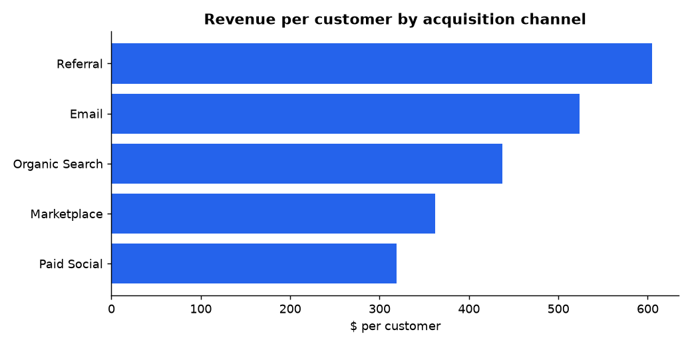
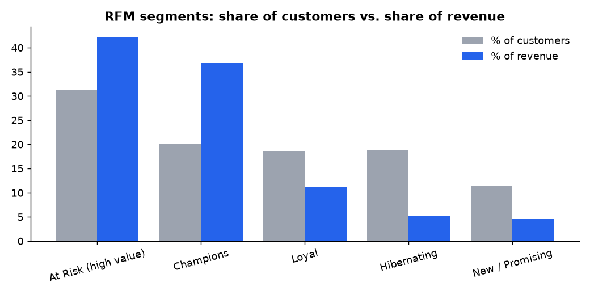
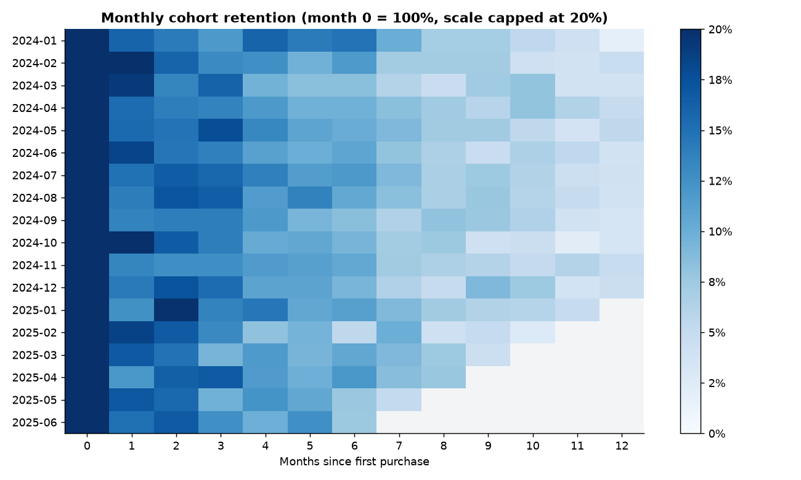
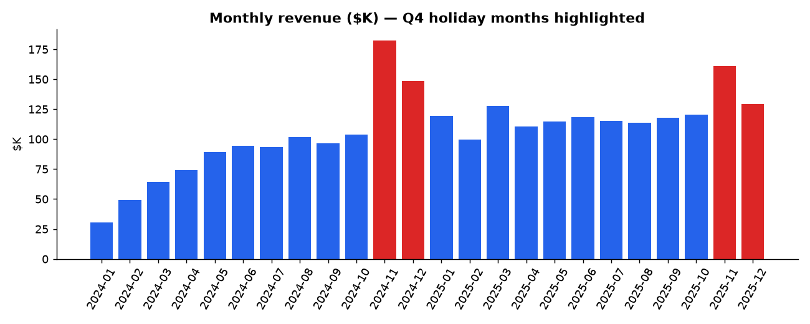

# 🛒 E-commerce Sales Performance & Customer Value Analysis

**Skills shown:** SQL (CTEs, window functions, `NTILE`, `LAG`) · Python (pandas, matplotlib) · KPI design · RFM segmentation · Cohort retention · Turning analysis into recommendations

> **Business problem.** Leadership at a mid-size online retailer sees revenue growing but margins under pressure. They asked:
> *"Where is our revenue really coming from, are our promotions paying off, and which customers should we invest in?"*

---

## 📊 Headline KPIs

| Year | Orders | Active customers | Revenue | AOV | Gross margin | Return rate |
|------|-------:|-----------------:|--------:|----:|-------------:|------------:|
| 2024 | 6,253 | 3,077 | $1.13M | $180 | 32.6% | 7.5% |
| 2025 | 8,049 | 4,151 | $1.45M | $180 | 33.6% | 7.3% |

Revenue grew **+28% YoY**, driven by **more customers, not bigger baskets** (AOV flat at $180).

## 🔍 Key findings

### 1. Electronics drives revenue but destroys margin


| Category | Revenue share | Margin | Return rate |
|---|---:|---:|---:|
| Electronics | **42.9%** | **19.8%** | **13.5%** |
| Fashion | 16.5% | 50.3% | 11.1% |
| Beauty | 5.4% | 56.0% | 3.5% |

Electronics brings in 43% of revenue at less than half the margin of Fashion, and has the highest return rate.

### 2. Deep discounts cut margin by two-thirds


Orders discounted 21–30% earn a **13.2% margin vs. 40.1% at full price**. Their return rate is also higher (9.3% vs 7.2%).

### 3. Acquisition channel predicts customer value


| Channel | Revenue / customer | Repeat rate |
|---|---:|---:|
| Referral | **$605** | **88.6%** |
| Email | $524 | 83.2% |
| Organic Search | $438 | 72.6% |
| Marketplace | $363 | 65.3% |
| Paid Social | **$319** | **51.3%** |

A referred customer is worth **1.9×** a Paid Social customer.

### 4. Revenue is concentrated, and a large high-value group is slipping away


- The **top 20% of customers generate 53% of revenue**.
- **"At Risk (high value)"**: 1,869 customers (31%) who used to spend heavily but haven't bought in ~412 days on average. They account for **42% of lifetime revenue**.

### 5. Retention drops off steeply after month 6


For 2024 cohorts, the share of customers buying again was **16.4% in month 1, 10.5% in month 6 and 4.0% in month 12**.

### 6. Seasonality


November is the peak month every year (+76% MoM in 2024, +34% in 2025). Revenue then drops 19–20% in December and January.

---

## ✅ Recommendations

| # | Recommendation | Expected impact | Owner |
|---|---|---|---|
| 1 | **Cap promotional discounts at 20%** except clearance; replace deep discounts with bundles | Recover margin on ~825 orders/yr currently at 13% margin | Merchandising |
| 2 | **Launch a win-back campaign for the "At Risk (high value)" segment** (personalised offers, 60-day trigger) | Each 10% re-activated (~187 customers) ≈ $34K from one $180 order each, more if they return to their earlier spending | CRM |
| 3 | **Move budget from Paid Social to Referral & Email** (e.g. referral credits) | Higher LTV per acquisition dollar | Marketing |
| 4 | **Electronics returns deep-dive**: better product content and size/spec guides | Each 1-pt cut in returns ≈ $11K revenue kept | Category / CX |
| 5 | **Post-purchase journey at day 30/60/90** to stop the drop-off after month 6 | Lift month-6 retention | CRM |

---

## 🛠 How to reproduce

```bash
pip install -r ../requirements.txt
python generate_data.py   # creates data/customers.csv and data/orders.csv (seeded, reproducible)
python analysis.py        # runs sql/queries.sql in SQLite, plus RFM & cohort analysis → outputs/
```

| File | Purpose |
|---|---|
| `sql/queries.sql` | 7 business questions answered in SQL |
| `analysis.py` | Runs the SQL, RFM segmentation, cohort retention, charts |
| `outputs/*.csv` | Result tables (paste them into Excel, Power BI or Tableau) |
| `outputs/*.png` | Charts used above |

> *Data is synthetic and generated for portfolio purposes. Patterns are modelled on typical e-commerce behaviour.*
