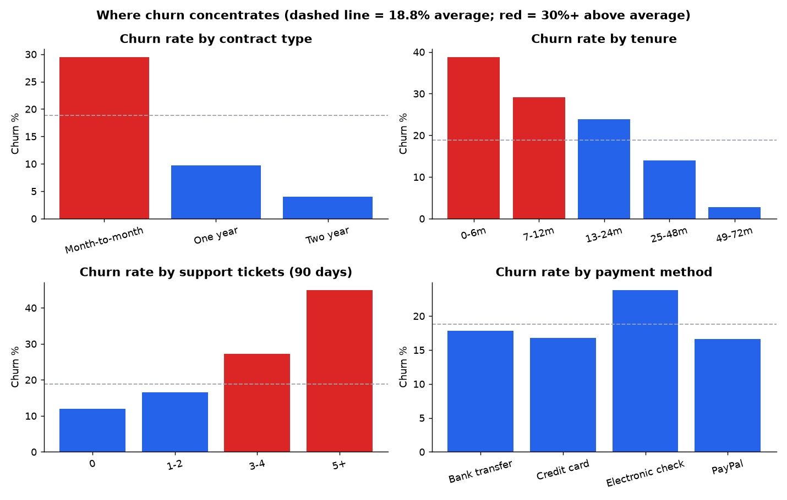
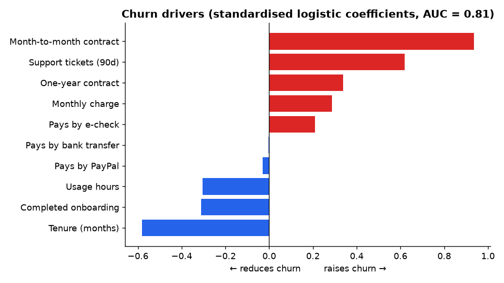
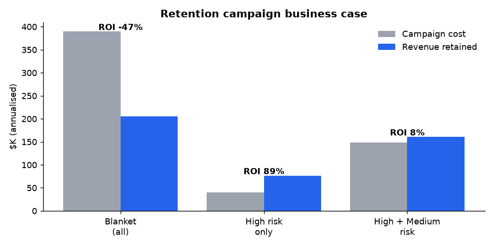

# 📉 Customer Churn Analysis & Retention Business Case

**Skills shown:** Root-cause analysis · Segmentation · Logistic regression (scikit-learn) · Risk scoring · Business case / ROI modelling · Stakeholder recommendations

> **Business problem.** A subscription business with 8,000 customers is losing **18.8% of them**, taking **$1.09M of annual recurring revenue** with them (20.6% of the base).
> The VP of Customer Success asked: *"Why are customers leaving, who is likely to leave next, and is a retention campaign worth funding?"*

Analytics framework: **Descriptive → Diagnostic → Predictive → Prescriptive**

---

## 1. Descriptive: where churn concentrates


| Segment | Churn rate | vs. average |
|---|---:|---:|
| 5+ support tickets in 90 days | **44.9%** | 2.4× |
| Tenure 0–6 months | **38.8%** | 2.1× |
| Month-to-month contract | **29.5%** | 1.6× |
| Pays by electronic check | 23.8% | 1.3× |
| Did **not** complete onboarding | 22.3% | 1.2× |
| Two-year contract | 4.0% | 0.2× |
| Tenure 49–72 months | 2.7% | 0.15× |

## 2. Diagnostic: what drives churn
A logistic regression on standardised features separates churners from stayers well (**AUC = 0.81** on held-out data).



**Raises churn:** month-to-month contract > support tickets > one-year contract (vs. two-year) > higher monthly charge > electronic check payment
**Lowers churn:** longer tenure > completing onboarding > higher product usage

👉 Churn is mostly **early-life and service-related**, not a pricing problem. The biggest levers are contract structure, the support experience and onboarding.

## 3. Predictive: who is likely to leave next
Every active customer gets a churn-risk score (`outputs/customer_risk_scores.csv`):

| Risk tier | Customers | Avg. risk | Expected revenue at risk |
|---|---:|---:|---:|
| High (>35%) | 675 | 48% | **$256K** |
| Medium (15–35%) | 1,800 | 23% | $280K |
| Low (<15%) | 4,021 | 6% | $149K |

The **High** tier is **10% of customers but 37% of the expected revenue at risk**.

## 4. Prescriptive: is a retention campaign worth funding?
**Assumptions:** the retention offer costs **$60 per customer** and saves **30%** of customers who would otherwise churn.



| Scenario | Contacted | Cost | Revenue retained | Net | ROI |
|---|---:|---:|---:|---:|---:|
| Blanket (everyone) | 6,496 | $390K | $206K | –$184K | **–47%** |
| **Targeted: High risk only** | **675** | **$41K** | **$77K** | **+$36K** | **+89%** |
| Targeted: High + Medium | 2,475 | $149K | $161K | +$12K | +8% |

**Recommendation: fund the targeted High-risk campaign.** It costs about 90% less than a blanket campaign and earns a positive return; the blanket campaign loses money.

---

## ✅ Recommendations

1. **Targeted retention campaign** for the 675 High-risk customers (above). Re-score monthly.
2. **Contract migration offer**: give month-to-month customers past 3 months of tenure an incentive to move to annual plans.
3. **Support escalation trigger**: when a customer logs their 3rd ticket in 90 days, route them to a senior agent and alert their CSM.
4. **Make onboarding mandatory**: customers who complete it churn 35% less (14.4% vs 22.3%).
5. **Payment-method nudge**: encourage moving from e-check to autopay card or bank transfer.

**KPIs to track:** monthly churn rate · 90-day churn of new customers · % on annual contracts · tickets per customer · campaign save rate

---

## 🛠 How to reproduce

```bash
pip install -r ../requirements.txt
python generate_data.py   # data/subscribers.csv (seeded)
python analysis.py        # outputs/ — segment tables, drivers, risk scores, ROI scenarios, charts
```

> *Data is synthetic, generated for portfolio purposes. Change `COST` and `SAVE_RATE` in `analysis.py` to run sensitivity analysis on the business case.*
