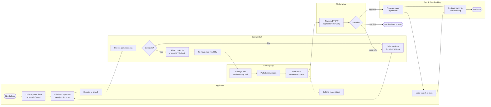
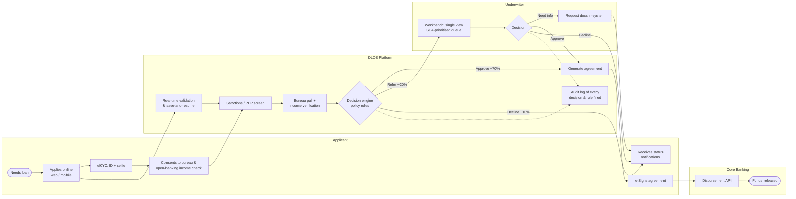

# Process Maps: AS-IS vs TO-BE

> Diagrams use Mermaid, which GitHub renders automatically.

## AS-IS: paper-based loan process (7–10 business days)

### Pain points identified
| # | Pain point | Root cause | Impact |
|---|---|---|---|
| P1 | 40% of forms incomplete | No validation, unclear guidance | 2–3 days of rework |
| P2 | Data re-keyed 3× | No integration between CRM, scoring, core | Errors, ~25 min per app |
| P3 | Manual ID checks | No eKYC tool | Inconsistent; 12 audit findings / yr |
| P4 | 100% of apps reviewed by an underwriter | No automated decisioning | Queue backlog, 4–5 day wait |
| P5 | No status visibility | No applicant notifications | ~1,100 chase calls / month |
| P6 | Branch visit required to apply and sign | Paper-only process | Drop-off; excludes remote customers |
| P7 | Underwriters gather data from 4 systems | No single view | ~30 min per review |
| P8 | Decisions poorly documented | Free-text notes | Hard to audit or explain decisions |
| P9 | No management reporting | Data spread across spreadsheets | SLA breaches found too late |

## TO-BE: digital loan origination (same day for ~70%)

## Gap analysis
| Area | AS-IS | TO-BE | Gap / change required | Requirement |
|---|---|---|---|---|
| Application capture | Paper form at branch | Online, validated, save-and-resume | Build digital form | FR-01–03 |
| Identity verification | Photocopy + visual check | eKYC with liveness + sanctions/PEP | Integrate eKYC vendor | FR-04, FR-05 |
| Income verification | Payslip copies | Open banking or upload | Integrate open-banking API | FR-07 |
| Credit decision | 100% manual | Rules engine; manual for exceptions only | Configure policy rules; maker-checker | FR-08, FR-09 |
| Underwriting | 4 systems, paper file | Single-view workbench | Build workbench & queue | FR-10–12 |
| Communication | Applicant calls to chase | Proactive email/SMS + portal | Notification service | FR-13, FR-14 |
| Contracting | Branch visit to sign | e-Signature | e-Sign integration | FR-15 |
| Disbursement | Re-keyed into core | API handover | Integrate existing API | FR-16 |
| Reporting | Manual spreadsheets | Real-time dashboard | Build ops dashboard | FR-17 |
| Audit | Free-text notes | Immutable decision log | Audit logging | FR-18 |

## Expected time saving per application
| Step | AS-IS | TO-BE |
|---|---:|---:|
| Capture & completeness checks | 2–3 days | Minutes (applicant self-serve) |
| Data entry (3×) | ~25 min staff time | 0 |
| KYC | ~1 day | < 2 min |
| Underwriting | 4–5 days queue | Instant (auto) / < 1 day (referred) |
| Contract & disbursement | 1–2 days + branch visit | Same day |
