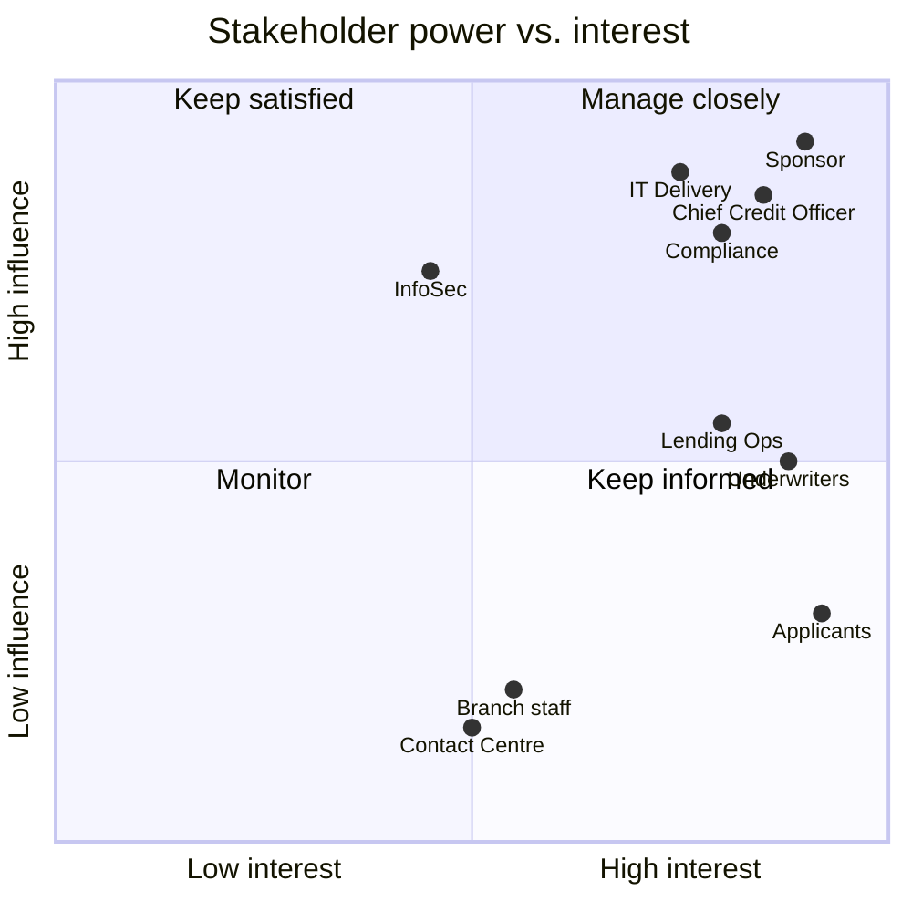

# Stakeholder Analysis & RACI

## Stakeholder register
| Stakeholder | Role in project | Interest | Influence | Key concerns | Engagement approach |
|---|---|---|---|---|---|
| Head of Retail Lending | Sponsor | High | High | Volume growth, time to market | Fortnightly steering; owns BRD sign-off |
| Chief Credit Officer | Credit policy owner | High | High | Credit losses, decision quality | Rules workshops; approves decision engine rules |
| Head of Compliance | Regulatory assurance | High | High | KYC/AML, fair lending, auditability | Requirements review; UAT of audit & KYC |
| Underwriters (team of 12) | End users | High | Medium | Workload, job change, usability | Co-design sessions, champions, training |
| Branch staff | Current process owners | Medium | Low | Role change, customer handover | Briefings, FAQ, change-impact sessions |
| Lending Ops Manager | Process owner | High | Medium | SLAs, exception handling | Weekly check-ins; owns ops dashboard reqs |
| IT Delivery Lead | Build & integration | High | High | Feasibility, vendor integration, timeline | Daily stand-ups; architecture reviews |
| Information Security | Control owner | Medium | High | Data protection, access control | NFR review; security sign-off |
| Customer Contact Centre | Downstream support | Medium | Low | Chase-call volumes, new FAQs | Training before go-live |
| Applicants (customers) | End users | High | Low (indirect) | Speed, simplicity, transparency | Usability testing with 8 customers |

## Power / interest grid

## RACI matrix
**R** = Responsible · **A** = Accountable · **C** = Consulted · **I** = Informed

| Activity | BA | Sponsor | Credit Risk | Compliance | IT Lead | Lending Ops | Underwriters | InfoSec |
|---|---|---|---|---|---|---|---|---|
| Elicit & document requirements | **R** | A | C | C | C | C | C | I |
| Approve BRD | R | **A** | C | C | C | C | I | C |
| Define credit policy rules | C | I | **A/R** | C | I | I | C | I |
| Map AS-IS / TO-BE processes | **R** | I | C | C | I | A | C | I |
| Write user stories & acceptance criteria | **R** | I | C | C | C | A | C | I |
| Solution design & build | C | I | I | I | **A/R** | I | I | C |
| Security & privacy review | C | I | I | C | R | I | I | **A** |
| UAT execution | **R** (coordinate) | I | R | R | C | A | R | I |
| Go-live decision | C | **A** | C | C | R | C | I | C |
| Training & change management | C | I | I | I | I | **A/R** | R | I |
