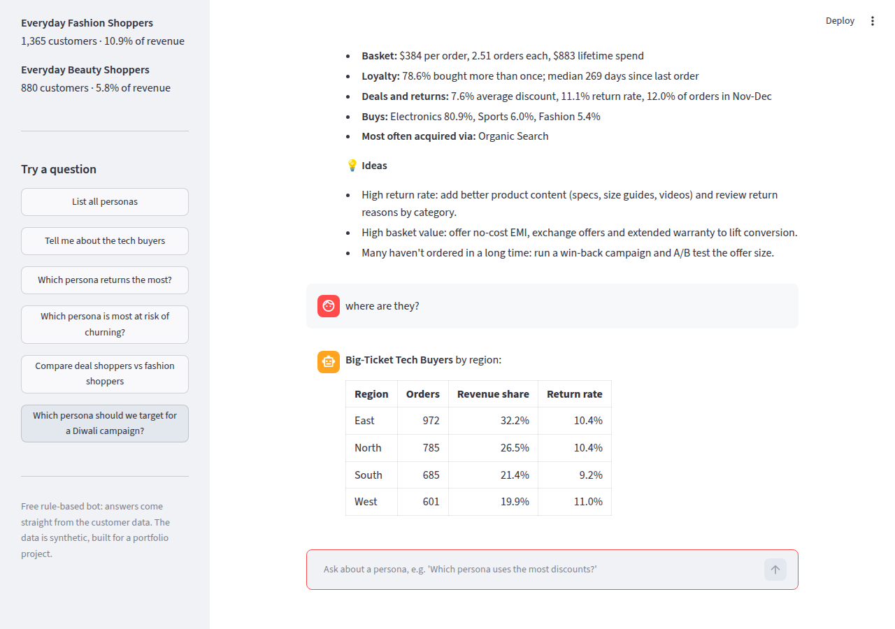
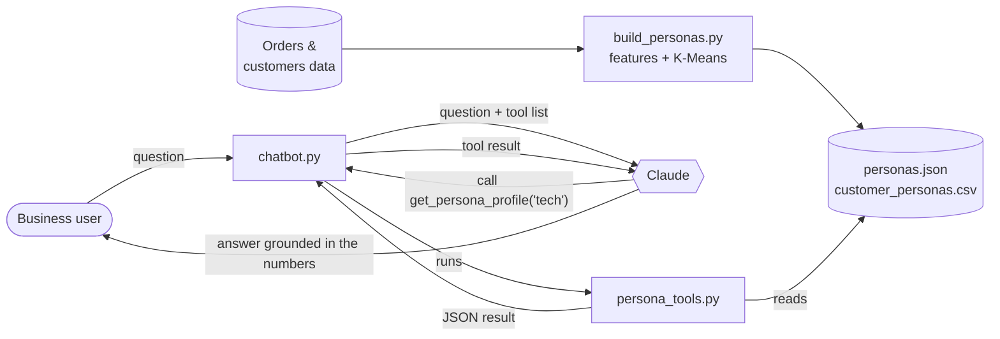

# 🤖 Persona Insights Chatbot (AI + Customer Analytics)

**Skills shown:** Customer segmentation (K-Means clustering) · Persona design · LLM tool use / function calling · Prompt design · Grounding AI answers in data · Python

> **Business problem.** Product, marketing and category teams keep asking the analytics team the same kinds of questions: *"Who are our discount-driven customers?"*, *"Which persona should we target for the festive sale?"*, *"How do tech buyers differ from fashion shoppers?"*
> This project builds a chatbot that answers those questions **from the actual customer data**, so teams can serve themselves.

There are **two versions**:

| | Free version (`free_bot.py` + `app.py`) | AI version (`chatbot.py`) |
|---|---|---|
| Cost | **Free**, no sign-up | Pay-per-use Claude API key |
| How it understands questions | Keyword rules ("intents") | AI model (Claude) |
| Handles unusual wording | Only phrasings it has rules for | Yes |
| Web page | ✅ Streamlit chat app, free hosting | Terminal only |
| Numbers come from | The data (same tools) | The data (same tools) |

## 🆓 Free version: web chat app



```bash
pip install -r ../requirements.txt
streamlit run app.py          # opens the chat page in your browser
python free_bot.py            # or chat in the terminal
python test_free_bot.py       # tests
```

**How it understands questions:** `free_bot.py` looks for persona words ("tech", "beauty", "deal") and intent words ("compare", "which… most", "returns", "churn", "where", "Diwali"). It picks the matching answer type, fetches the numbers with the same tools the AI version uses, and fills them into a written template with rule-based ideas. It also remembers the last persona, so *"where are they?"* works as a follow-up.

### Put it online for free (Streamlit Community Cloud)
1. Make your GitHub repo **public**, and make sure this branch is merged into `main`.
2. Go to **share.streamlit.io** and sign in with GitHub.
3. Click **Create app** → choose your repo, branch `main`, and main file path `04-persona-insights-chatbot/app.py` → **Deploy**.
4. In a few minutes you get a public link like `https://your-app.streamlit.app`. Add it to your LinkedIn Featured section and the top of this README.

Free apps go to sleep after a few days with no visitors. Whoever opens the link next sees a "wake up" button, and the app restarts in under a minute.

## 🤖 AI version

Example of what a session looks like (illustrative):

```text
You: Which persona should we target for a Diwali campaign, and why?
  [tool] list_personas({})
  [tool] get_persona_profile({'persona_name': 'Deal & Festive Shoppers'})
  [tool] compare_personas({'persona_a': 'Deal & Festive Shoppers', 'persona_b': 'Big-Ticket Tech Buyers'})

Assistant: Target the Deal & Festive Shoppers first ...
```

---

## 🧠 How the AI version works



There are three steps, one file each:

| Step | File | What it does | Concept to learn |
|---|---|---|---|
| 1 | `build_personas.py` | Builds one row of behaviour per customer (frequency, basket value, recency, discount use, returns, holiday buying, category mix), clusters them into 5 groups, and names each group by its standout traits | **Segmentation**: personas should come from behaviour data, not guesswork |
| 2 | `persona_tools.py` | Five small functions that look things up in the persona data, plus a description of each that Claude reads | **Tool use (function calling)**: the AI asks for data, your code fetches it |
| 3 | `chatbot.py` | The chat loop: send the question, run any tools Claude asks for, send back the results, repeat until Claude answers | **The agent loop**, and why the AI can't make up numbers |

### Why use tools instead of pasting all the data into the prompt?
- **Accuracy:** Claude answers from numbers the code calculates, so it doesn't invent statistics.
- **Scale:** real platforms have millions of customers, far too much to paste in. Tools fetch only what each question needs.
- **Trust:** the `[tool]` lines show exactly what data each answer used, which stakeholders can audit.

## 👥 The personas (from the data)

| Persona | Customers | Revenue share | Avg order value | Orders / customer | Avg discount | Return rate |
|---|---:|---:|---:|---:|---:|---:|
| Big-Ticket Tech Buyers | 1,213 | **41.6%** | $384 | 2.5 | 7.6% | **11.1%** |
| Deal & Festive Shoppers | 1,322 | 26.0% | $142 | **3.4** | **16.1%** | 6.9% |
| Everyday Home & Kitchen Shoppers | 1,220 | 15.8% | $150 | 2.2 | 6.6% | 6.3% |
| Everyday Fashion Shoppers | 1,365 | 10.9% | $128 | 1.6 | 6.2% | 7.4% |
| Everyday Beauty Shoppers | 880 | 5.8% | $77 | 2.1 | 7.6% | 4.9% |

## 🧰 The tools Claude can call

| Tool | Answers questions like |
|---|---|
| `list_personas` | "What personas do we have?" |
| `get_persona_profile` | "Tell me about the Deal & Festive Shoppers" |
| `compare_personas` | "How do tech buyers differ from beauty shoppers?" |
| `persona_breakdown` | "Where are our tech buyers, and which region returns the most?" |
| `sample_customers` | "Show me a few example customers in this persona" |

## ▶️ Run it

```bash
pip install -r ../requirements.txt
cd ../01-ecommerce-sales-analysis && python generate_data.py && cd -   # only if the data isn't there yet
python build_personas.py      # step 1: build the personas
python test_chatbot.py        # offline tests, no API key needed
export ANTHROPIC_API_KEY=...  # get a key at https://console.anthropic.com
python chatbot.py             # step 3: start chatting
```

**Cost:** each question makes a few API calls. Expect a few US cents per question; check your usage in the Anthropic Console.

### Questions to try
- Which persona should we target for a Diwali campaign, and why?
- Our return costs are rising. Which persona and region should we look at first?
- Compare Deal & Festive Shoppers with Everyday Fashion Shoppers. What offer would suit each?
- Which persona is most at risk of churning, and what's one A/B test to win them back?
- Describe the Big-Ticket Tech Buyer as if writing a one-page persona card for the design team.

## 📚 Learning path

1. **Read `build_personas.py`.** Change `N_PERSONAS` to 4 or 6 and re-run. Do the personas still make business sense? Choosing the number of clusters is a business decision as much as a statistical one.
2. **Read `persona_tools.py`.** Notice that each tool's `description` is written for Claude, the way you'd brief a colleague. Better descriptions lead to better tool choices.
3. **Read `chatbot.py`.** Follow the `while True` loop. It is the core pattern behind most AI agents.
4. **Add your own tool**, for example `top_products(persona_name)`: write the function, add its definition to `TOOLS` and to `_FUNCTIONS`, then ask a question that needs it.
5. **Edit the system prompt** to change the bot's style, for example "always end with one experiment to run", and see how the answers change.

## 🚀 Ideas to extend it
- **Web interface:** wrap `ask()` in a [Streamlit](https://streamlit.io) chat app (about 30 lines) and share it with a link.
- **Voice of the customer:** add product reviews or support tickets and a tool that searches them, so the bot can say what each persona *says*, not just what they *do*.
- **Persona role-play:** let a product manager "interview" a persona about a new feature idea. Label the answers clearly as hypotheses to test, not research findings.
- **Evaluation:** write 20 questions with known answers and check the bot gets the numbers right after each change.

## 💬 Talking about this in an interview
> "I built a self-serve insights chatbot. First I segmented 6,000 customers into five behavioural personas with K-Means. Then I exposed the persona data to an LLM through five tools, so every answer is grounded in calculated numbers rather than generated ones. That means a marketing manager can ask 'who should we target for the festive sale?' and get a data-backed answer in seconds instead of raising an analytics ticket."

> *Data is synthetic (from Project 1). The personas and numbers are reproducible from the fixed random seeds.*
