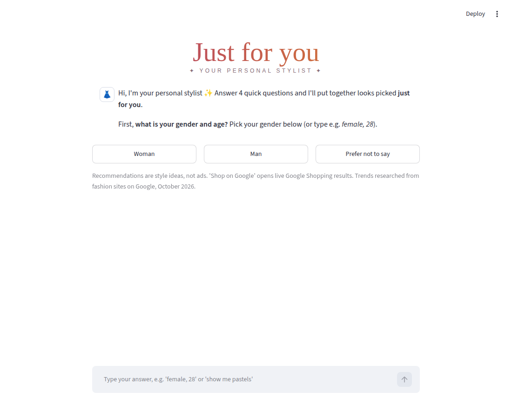
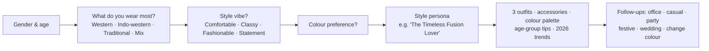
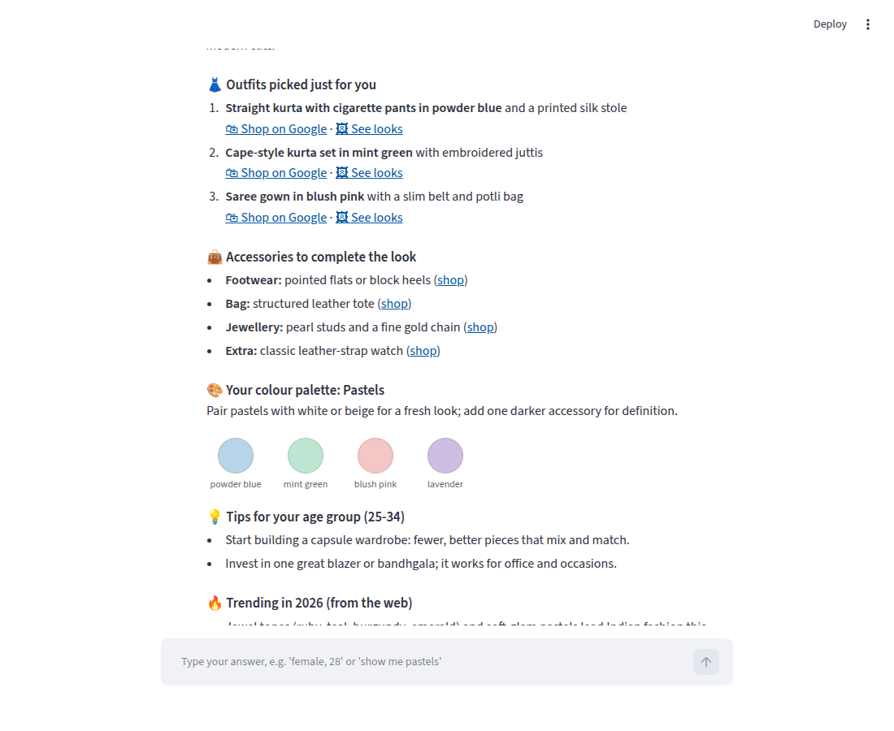

# 👗 Just for you: Personal Styling Chatbot

**Skills shown:** Customer persona design · Conversational UX · Recommendation logic · Trend research · Python · Streamlit

> **Business problem.** Fashion shoppers face thousands of products and leave without buying when they can't picture what suits them.
> **Just for you** asks 4 quick questions, builds the shopper's **style persona**, and recommends outfits, accessories and colours, with one-tap links to shop each item on Google.



## 💬 How the conversation works



Customers can **tap buttons** or **type freely**. For example, *"female, 28"* answers the first question in one go, and *"show me pastels"* updates the looks afterwards.



## 🧩 What it covers
| Input | Options |
|---|---|
| Gender | Woman · Man · Prefer not to say (gender-neutral looks) |
| Age | Under 18 · 18-24 · 25-34 · 35-44 · 45-54 · 55+ |
| Wear | Western · Indo-western · Traditional · A mix |
| Vibe | Comfortable · Classy · Fashionable · Statement |
| Colour | Neutrals · Pastels · Earthy · Jewel tones · Bright & bold · Monochrome · Surprise me (2026 trend colours) |
| Occasions | Office · Casual weekend · Party · Festive / puja · Wedding |

That's **2,016 combinations** of answers (3 × 6 × 4 × 4 × 7), each with its own persona, colour-matched outfits and accessories. All of them are checked by the tests.

## 🌐 Where the "Google insights" come from
- **2026 trends:** researched on Google from fashion and retail sites (Pantone, W Magazine, Aza Fashions and Indian ethnic-wear brands) and summarised in `style_knowledge.py`. Each trend shown in the chat links to its source.
- **Live products:** every recommended item has **🛍 Shop on Google** (Google Shopping) and **🖼 See looks** (Google Images) links. They are built from the exact item and colour, e.g. *"mint green cape-style kurta set women"*, so customers always see current products and prices.

The app stays **100% free**: no AI model, no API key, no paid search API.

## ▶️ Run it
```bash
pip install -r requirements.txt
streamlit run app.py       # web chat
python stylist.py          # same chatbot in the terminal
python test_stylist.py     # tests
```

### Put it online (free, public, shareable)
On **share.streamlit.io** → **Create app** → **Deploy a public app from GitHub**, then paste the link to this folder's `app.py`, e.g.
`https://github.com/<your-username>/<your-repo>/blob/main/05-just-for-you-stylist/app.py`

## 🗂 Files
| File | What it does |
|---|---|
| `style_knowledge.py` | All styling content: outfits, accessories, palettes, age tips, occasion looks, 2026 trends with sources. **Edit this to refresh the bot.** |
| `stylist.py` | Conversation engine: asks the questions, understands typed answers, builds the persona and recommendations |
| `app.py` | The web page: "Just for you" logo, chat, quick-reply buttons, colour swatches |
| `test_stylist.py` | Checks typed-answer parsing, the full flow and all 2,016 combinations |

## 🚀 Ideas to extend it
- Add photos for each outfit, and real product links from a store catalogue.
- Add body-type, budget or skin-undertone questions for sharper recommendations.
- Track which looks customers click to learn which personas convert best. That's a natural A/B testing project.
- Swap the rule-based answers for an AI model so customers can ask anything ("what goes with a mustard kurta?").

> Style recommendations are general ideas. Trends were researched in October 2026; update `style_knowledge.py` to keep them current.
