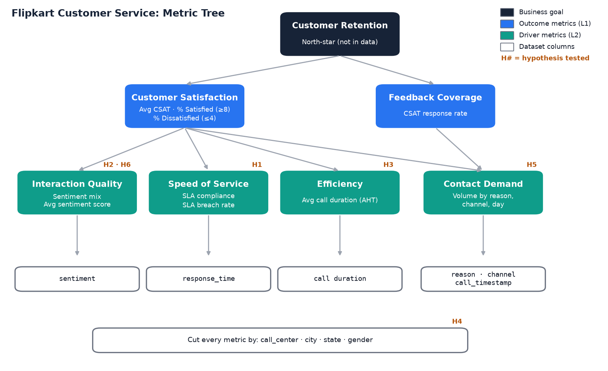
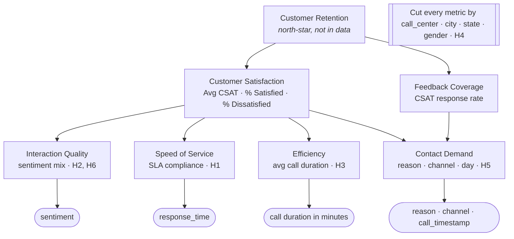

# Checkpoint 1: Business Context, Metrics and Hypotheses

## Business context

Flipkart's customer retention is falling. Customer service is one of the few moments where Flipkart talks to a customer directly, so a poor service experience is a likely cause of churn. It is also something the company controls.

The dataset has **30,000 customer-service contacts from 1 to 31 October 2020** in 13 columns:

| Column | Meaning | Type |
|---|---|---|
| `id` | Unique contact ID | text |
| `customer_name`, `Gender` | Customer | text |
| `sentiment` | Very Negative / Negative / Neutral / Positive / Very Positive | ordinal |
| `csat_score` | Survey score 1–10 (blank = no answer) | numeric |
| `call_timestamp` | Contact date (MM/DD/YYYY) | date |
| `reason` | Billing Question / Payments / Service Outage | category |
| `city`, `state` | Customer location | category |
| `channel` | Call-Center / Chatbot / Email / Web | category |
| `response_time` | Below SLA / Within SLA / Above SLA | ordinal |
| `call duration in minutes` | Handle time (5–45) | numeric |
| `call_center` | Delhi / Mumbai / Kolkata / Chennai | category |

The data has **no retention field** (repeat orders, churn). **CSAT is therefore the proxy outcome.** Satisfied customers are the ones most likely to stay.

## Key metrics

| Level | Metric | Definition | Why it matters | Column(s) |
|---|---|---|---|---|
| Goal | Customer retention | Repeat-purchase / churn rate | North-star; not in the data | — |
| L1 outcome | **Average CSAT** | Mean `csat_score` of rated contacts | Main proxy for satisfaction and retention | csat_score |
| L1 outcome | **% Satisfied** | Rated contacts with CSAT 8–10 | Most likely to come back | csat_score |
| L1 outcome | **% Dissatisfied** | Rated contacts with CSAT 1–4 | Churn-risk signal | csat_score |
| L1 outcome | **CSAT response rate** | Rated contacts / all contacts | How much of the customer voice we hear | csat_score |
| L2 driver | **Negative-sentiment share** | (Negative + Very Negative) / contacts | Emotional state of the interaction | sentiment |
| L2 driver | **SLA compliance / breach rate** | Within+Below SLA / contacts; Above SLA / contacts | Speed of service | response_time |
| L2 driver | **Average handle time (AHT)** | Mean call duration | Efficiency; long calls can mean hard problems | call duration in minutes |
| L2 driver | **Contact volume & mix** | Contacts by reason, channel, day | High contact volume shows friction in the product | reason, channel, call_timestamp |
| Cut | **Location performance** | Every metric above by call centre / state | Finds weak sites or training gaps | call_center, city, state |

## Metric tree

## Hypotheses

| ID | Hypothesis | Metric tested | Columns | Test |
|---|---|---|---|---|
| **H1** | Reducing response time (fewer Above-SLA contacts) will improve CSAT and retention | Avg CSAT by response_time | response_time, csat_score | Welch t-test: Above SLA vs rest |
| **H2** | Customer-service training that addresses negative sentiment will increase CSAT and retention | Avg CSAT by sentiment | sentiment, csat_score | Pearson r (sentiment score 1–5 vs CSAT) |
| **H3** | Reducing call duration through efficient processes will improve CSAT and retention | Avg CSAT by duration band | call duration in minutes, csat_score | Pearson r + t-test on r |
| **H4** | CSAT and SLA performance differ by call-centre location | Avg CSAT and SLA breach by centre | call_center, csat_score, response_time | Spread between centres (≥ 0.3 pts = meaningful) |
| **H5** | Some channels (e.g. Chatbot) give lower CSAT | Avg CSAT by channel | channel, csat_score | Welch t-test: Chatbot vs rest |
| **H6** | Unhappy customers skip the CSAT survey (non-response bias) | Response rate by sentiment | sentiment, csat_score | Response-rate gap Very Neg vs Very Pos (≥ 3 pts) |

Significance level α = 0.05. Results are in [Final_Report.md](Final_Report.md) and the `Hypothesis_Tests` sheet of the workbook.
